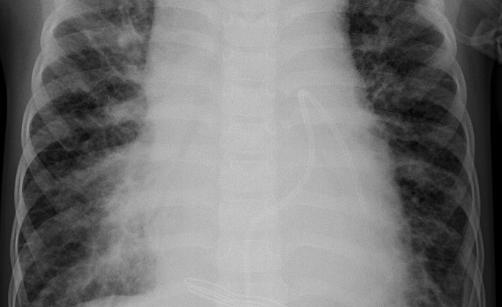

# XRayConv
### Pneumonia Diagnosis with Deep Learning

In this repository a pretrained ResNet50 Convolutional Neural was retrained to perform diagnosis of pneumonia
through a process known as transfer learning. The model was able to achieve an accuracy of 90%. To check out the
Exploratory Data Analysis click . To see the how the transfer learning was performed click .
